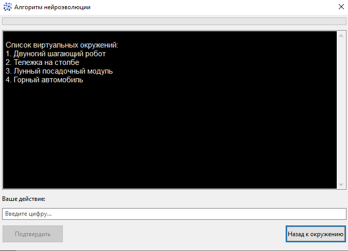
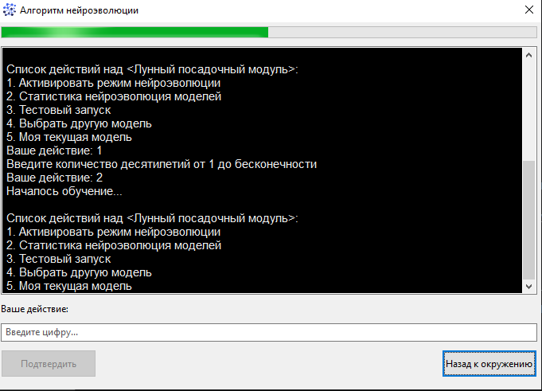
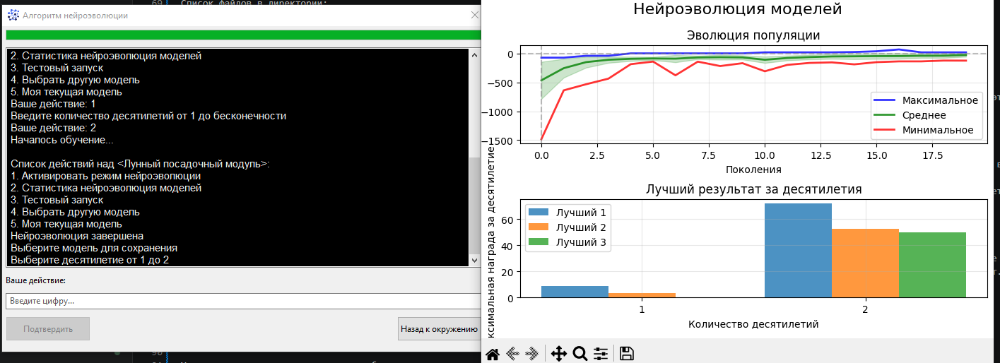
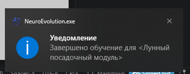
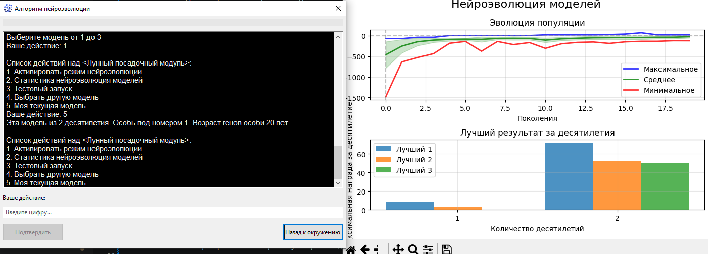
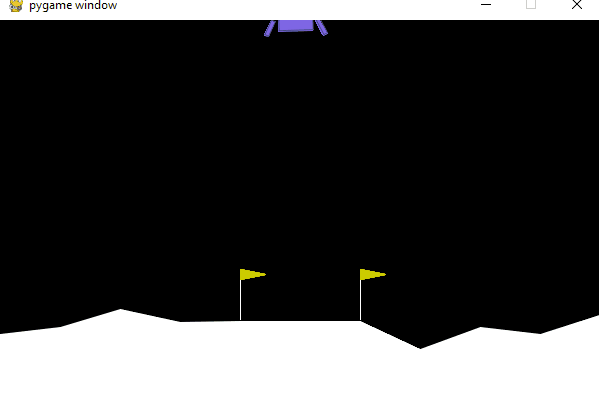
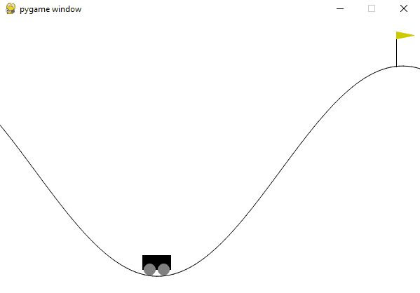
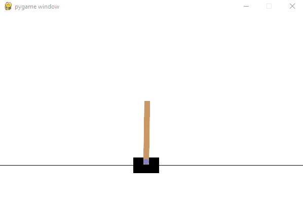

# Алгоритм нейроэволюции

Библиотека объединяет в себе нейронный и генетический алгоритм для обучения взаимодействия агента с окружающей средой из библиотеки `gymnasium`.

Для настройки и добавления окружающей среды в программу нужно в папке `environs` создать свой класс унаследованный от `from neuro_gym import Environ`. Эта папка находится с исполняемой программой.

Пример `Лунный посадочный модуль`:

```python

from typing import Dict, Union
import torch
import numpy as np
from neuro_gym.environ import Environ, Complexity


class LunarLander(Environ):
    
    @property
    def id(self) -> str:
        return 'LunarLander-v3'
    
    @property
    def name(self) -> str:
        return 'Лунный посадочный модуль'
    
    @property
    def params(self) -> Dict:
        return {
            'id': self.id,
            'continuous': False, 
            'gravity': -10.0, # 0 до -12.0
            'enable_wind': True,  # случайным образом в диапазоне от -9999 до 9999
            'wind_power': 20.0,  #  от 0 до 20.0
            'turbulence_power': 2.0 #  от 0 до 2.0
        }
    
    @property
    def complexity(self) -> int:
        return Complexity.LOW
    
    @property
    def number_input_neurons(self) -> int: 
        return 8
    
    @property
    def number_output_neurons(self) -> int: 
        return 4
    
    @property
    def calc_confidence(self) -> bool: 
        return True
    
    def update_vector(self, output_vector: Union[np.ndarray, torch.Tensor]) -> int:
        return torch.argmax(output_vector, dim=-1).item()
```

Свойства: 
- `id`, `name`, `params` - можно найти на `gymnasium.farama.org`. 
- `complexity` - относится к числу скрытых нейронов в нейронной модели, которые будут задействованы для игры и обучения. 
- `number_input_neurons` - размер входного вектора или число признаков, которые отдаются из переменной `observation` после каждого шага. Это нужно тоже уточнять в `gymnasium.farama.org`. 
- `number_output_neurons` - размер выходного вектора из нейросети. 
- `calc_confidence` - эта опция дает заработать дополнительное вознаграждение за уверенное действие. 
- `update_vector` - метод который преобразует выходной вектор нейронной сети в данные пригодные для передачи в метод игры `action`.

Запуск программы производится через исполняемый файл `neuro_evolution.exe`.

Список файлов в директории:
- `environs` - директория содержит файлы с окружением.
- `settings.py` - настройки работы нейроэволюции.
- `neuro_evolution.exe` - программа.
- `logs` - логирование работы программы.
- `statistic` - здесь сохраняются обученные модели.

Первый запуск программы. Программа представляет из себя подобие консольного приложения. Данный вариант программы не блокируется при обучение агента, это дает возможность поставить в очередь на обучение сразу несколько вариантов.  

В самой программе был добавлен микрофреймворк по созданию подпроцессов и их взаимодействия между собой. Один подпроцесс отображает визуальную часть, а другой подпроцесс обучает. Обучение - это нагрузка на ЦПУ. Поэтому обучение пока происходит последовательно.



Для обучения моделей есть режим нейроэволюции. Он предназначен для улучшения показателей взаимодействия со сценой. Количество лет обучений измеряется в десятилетиях. В каждом десятилетии выбирается три лучших особи для сохранения в зал славы.
Обучение сопровождается визуальным элементом заполнение прогресс бара. Пока модель обучается повторная активация невозмжна для этой модели. При обучение идет сохранение промежуточных данных в файл.



По завершению обучения будет выведен график и предложан выбор сохранить обученную модель. Также по завершению появится уведомление. Оно появляется вне зависимости от контекста в консоли. Это значит, что если в консоли находится список окружений и не заполняется прогресс бар, то обучение всеравно идет. В какой-то момент придет уведомление. Можно будет перейти в нужное окружение и сохранить модель.

Сохранение модели. На диаграмме можно выбрать модель для сохранения в файл.



Уведомление о завершение процесса обучения.



После этого можно проверить свою сохраненную версию модели.



Процесс выбора модели также можно повторить для повторного сохранения. Это может пригодится для тестирования разных моделей.

Опция для тестирования открывает виртуальную среду, в которую помещает агента и обученную нейронную модель для взаимодействя со средой. Успешно ли агент взаимодействовал со средой или нет можно определить по общей награде. У каждой среды свое количество наград.

### Примеры обученных агентов.

Лунный посадочный модуль. У модуля есть три двигателя и направление движения. Нейронная сеть должна уметь управлять этими двигателями и корректировать посадку модуля.



Горный автомобиль. Здесь нейронная сеть совершает действие вперед, назад или по инерции. Игра успешно пройдена, если автомобиль заехал на гору.



Тележка на столбе. Здесь нейронная сеть должна двигать тележку в право или влево, чтобы не упал шест.

